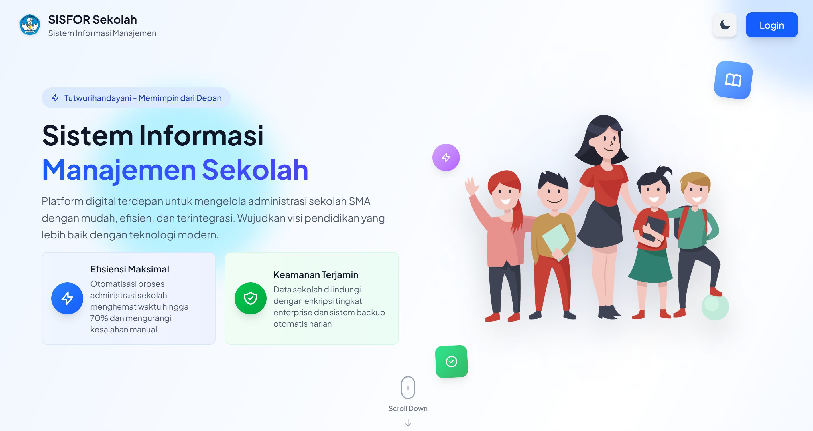
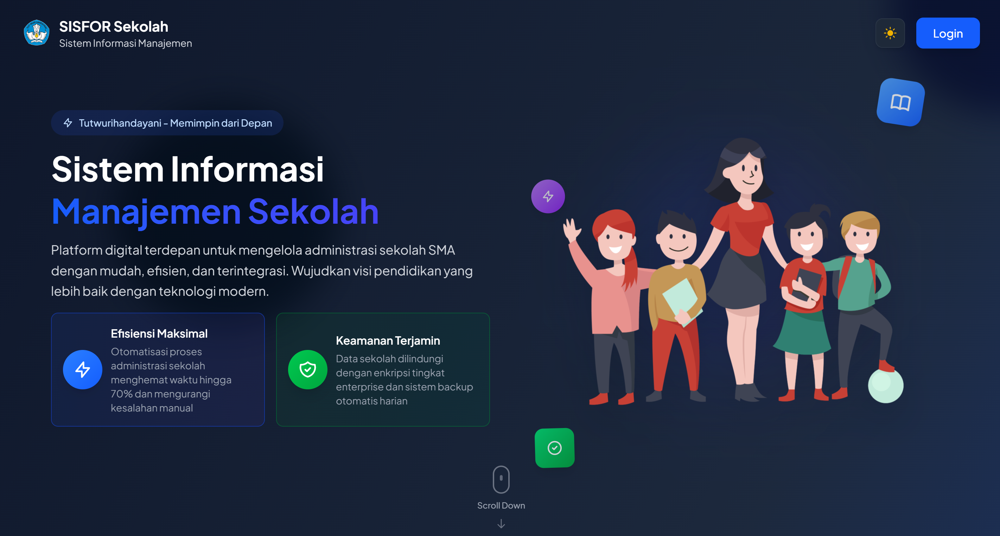

# 🏫 SISFOR Sekolah - Sistem Informasi Manajemen Sekolah

<div align="center">
  
  
  **Platform Digital Terdepan untuk Manajemen Sekolah SMA**
  
  [](https://laravel.com)
  [](https://reactjs.org)
  [](https://www.typescriptlang.org)
  [](https://tailwindcss.com)
  [](https://inertiajs.com)

  [](https://opensource.org/licenses/MIT)
  [](https://github.com/your-username/sisfor-sekolah)
</div>

## 📋 Deskripsi

SISFOR Sekolah adalah sistem informasi manajemen sekolah yang komprehensif, dirancang khusus untuk memenuhi kebutuhan administrasi dan operasional sekolah menengah atas (SMA). Platform ini menggabungkan teknologi modern dengan antarmuka yang intuitif untuk memberikan solusi terpadu dalam pengelolaan data akademik, siswa, guru, dan berbagai aspek operasional sekolah.

## 📸 Screenshots

### Light Mode


### Dark Mode


### 🎯 Visi & Misi

**Visi:** Mewujudkan digitalisasi pendidikan yang efisien dan terintegrasi untuk mencerdaskan kehidupan bangsa.

**Misi:** 
- Menyediakan platform teknologi terdepan untuk manajemen sekolah
- Meningkatkan efisiensi administrasi pendidikan hingga 70%
- Memastikan keamanan data dengan standar enterprise
- Mendukung transformasi digital sektor pendidikan Indonesia

## ✨ Fitur Utama

### 📚 Manajemen Akademik
- **Master Data Siswa** - Database siswa terpusat dengan profil lengkap
- **Master Data Guru** - Manajemen data pendidik dan tenaga kependidikan
- **Master Data Kelas** - Struktur kelas dan pembagian siswa
- **Master Data Jurusan** - Program keahlian dan konsentrasi studi

### 📖 Kurikulum & Pembelajaran
- **Master Data Pelajaran** - Mata pelajaran dan silabus terintegrasi
- **Master Data Kurikulum** - Struktur kurikulum nasional dan lokal
- **Jadwal Mengajar** - Penjadwalan otomatis guru dan kelas
- **Sistem Penilaian** - Evaluasi dan assessment komprehensif

### 🏢 Manajemen Operasional
- **Master Data Inventori** - Pengelolaan aset dan fasilitas sekolah
- **Master Data Vendor** - Database supplier dan mitra kerja
- **Manajemen Pengumuman** - Sistem komunikasi sekolah terpusat
- **Sistem Pelaporan** - Laporan administratif dan analitik

### 📊 Monitoring & Evaluasi
- **Data Pelanggaran Siswa** - Sistem kedisiplinan terintegrasi
- **Data Prestasi Siswa** - Pencapaian dan penghargaan
- **Analisis Kinerja** - Evaluasi performa sekolah real-time
- **Dashboard Analitik** - Visualisasi data komprehensif

## 🛠️ Teknologi Stack

### Backend
- **Laravel 12.x** - PHP Framework untuk backend API
- **MySQL/SQLite** - Database management system
- **PHP 8.2+** - Server-side programming language

### Frontend
- **React 19.x** - Modern JavaScript library untuk UI
- **TypeScript 5.7** - Type-safe JavaScript development
- **Inertia.js 2.0** - Modern monolith architecture
- **Tailwind CSS 4.0** - Utility-first CSS framework
- **Framer Motion 12.x** - Animation library untuk React

### Development Tools
- **Vite 6.0** - Fast build tool dan development server
- **ESLint 9.x** - Code linting dan quality assurance
- **Prettier 3.4** - Code formatting
- **TypeScript 5.7** - Static type checking

## 📦 Persyaratan Sistem

### Minimum Requirements
- **PHP:** 8.2 atau lebih tinggi
- **Node.js:** 20.x atau lebih tinggi
- **NPM/Yarn:** Package manager terbaru
- **Composer:** PHP dependency manager
- **Database:** MySQL 8.0+ atau SQLite 3.x
- **Web Server:** Apache/Nginx dengan mod_rewrite

### Recommended Specifications
- **RAM:** 4GB atau lebih
- **Storage:** 10GB free space
- **CPU:** Multi-core processor
- **OS:** Linux/macOS/Windows 10+

## 🚀 Instalasi & Setup

### 1. Clone Repository
```bash
git clone https://github.com/prassaaa/sisfor-sekolah.git
cd sisfor-sekolah
```

### 2. Install Dependencies
```bash
# Install PHP dependencies
composer install

# Install Node.js dependencies
npm install
```

### 3. Environment Configuration
```bash
# Copy environment file
cp .env.example .env

# Generate application key
php artisan key:generate
```

### 4. Database Setup
```bash
# Create database (MySQL)
mysql -u root -p -e "CREATE DATABASE sisfor_sekolah;"

# Run migrations
php artisan migrate

# Seed database (optional)
php artisan db:seed
```

### 5. Build Assets
```bash
# Development build
npm run dev

# Production build
npm run build
```

### 6. Start Development Server
```bash
# Start Laravel server
php artisan serve

# Start Vite dev server (new terminal)
npm run dev
```

Aplikasi akan tersedia di `http://localhost:8000`

## 🔧 Konfigurasi Environment

### Database Configuration
```env
DB_CONNECTION=mysql
DB_HOST=127.0.0.1
DB_PORT=3306
DB_DATABASE=sisfor_sekolah
DB_USERNAME=your_username
DB_PASSWORD=your_password
```

### Application Settings
```env
APP_NAME="SISFOR Sekolah"
APP_ENV=local
APP_KEY=base64:your_generated_key
APP_DEBUG=true
APP_URL=http://localhost:8000
```

## 📱 Deployment

### Production Deployment
```bash
# Optimize for production
composer install --optimize-autoloader --no-dev
php artisan config:cache
php artisan route:cache
php artisan view:cache

# Build production assets
npm run build

# Set proper permissions
chmod -R 755 storage bootstrap/cache
```

### Server Configuration
- Configure web server untuk point ke `public/` directory
- Set up SSL certificate untuk HTTPS
- Configure database connection
- Set up backup dan monitoring

## 🤝 Contributing

Kami menyambut kontribusi dari komunitas! Silakan ikuti panduan berikut:

1. Fork repository ini
2. Create feature branch (`git checkout -b feature/AmazingFeature`)
3. Commit changes (`git commit -m 'Add some AmazingFeature'`)
4. Push to branch (`git push origin feature/AmazingFeature`)
5. Open Pull Request

### Development Guidelines
- Ikuti PSR-12 coding standards untuk PHP
- Gunakan ESLint dan Prettier untuk JavaScript/TypeScript
- Tulis unit tests untuk fitur baru
- Update dokumentasi sesuai perubahan

## 📄 License

This project is licensed under the MIT License - see the [LICENSE](LICENSE) file for details.

## � Keamanan

SISFOR Sekolah mengimplementasikan standar keamanan enterprise:

- **Enkripsi Data** - AES-256 encryption untuk data sensitif
- **Authentication** - Multi-factor authentication support
- **Authorization** - Role-based access control (RBAC)
- **Backup Otomatis** - Daily automated backup system
- **Audit Trail** - Comprehensive logging system
- **HTTPS** - SSL/TLS encryption untuk semua komunikasi

## 🧪 Testing

```bash
# Run PHP tests
php artisan test

# Run JavaScript tests
npm run test

# Run E2E tests
npm run test:e2e

# Generate coverage report
php artisan test --coverage
```

## 🙏 Acknowledgments

- [Laravel](https://laravel.com) - The PHP Framework for Web Artisans
- [React](https://reactjs.org) - A JavaScript library for building user interfaces
- [Tailwind CSS](https://tailwindcss.com) - A utility-first CSS framework
- [Inertia.js](https://inertiajs.com) - The Modern Monolith
- [Framer Motion](https://www.framer.com/motion/) - Production-ready motion library for React

---

<div align="center">
  <p><strong>SISFOR Sekolah</strong> - Memajukan Pendidikan Indonesia Melalui Teknologi</p>
  <p>Made with ❤️ for Indonesian Education</p>
</div>
